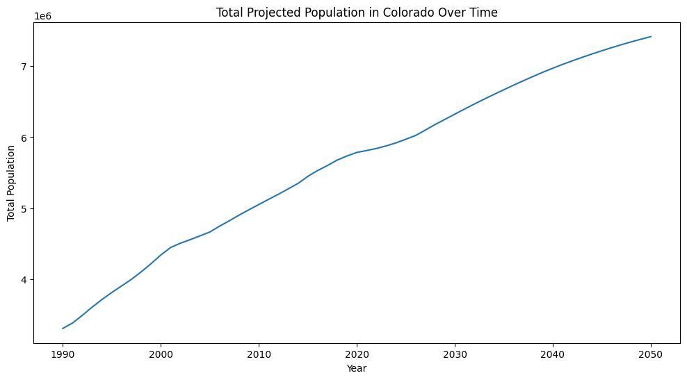

<ul class="nav">
  <li><a href="index.html">Home</a></li>
  <li><a href="introduction.html">Introduction</a></li>
  <li><a href="conclusion.html">Conclusions</a></li>
  <li class="dropdown">
    <a href="dataprep_eda.html" class="dropbtn">DataPrep_EDA</a>
    <div class="dropdown-content">
      <a href="clustering.html">Clustering</a>
      <a href="arm.html">ARM</a>
      <a href="naivebayes.html">NaiveBayes</a>
      <a href="dectrees.html">DecTrees</a>
      <a href="svms.html">SVMs</a>
      <a href="regression.html">Regression</a>
      <a href="nn.html">NN</a>
    </div>
  </li>
</ul>

<style>
.nav {
  list-style-type: none;
  margin: 0;
  padding: 0;
  overflow: hidden;
}

.nav li {
  float: left;
  position: relative;
}

.nav li a, .dropbtn {
  display: inline-block;
  padding: 14px 16px;
  text-decoration: none;
  background-color: #f9f9f9;
}

.nav li .dropdown-content {
  display: none;
  position: absolute;
  background-color: #f9f9f9;
  min-width: 160px;
  box-shadow: 0px 8px 16px 0px rgba(0,0,0,0.2);
}

.nav li:hover .dropdown-content {
  display: block;
}

.dropdown-content a {
  color: black;
  padding: 12px 16px;
  display: block;
  text-decoration: none;
}

.dropdown-content a:hover {
  background-color: #ddd;
}
</style>

# Data Prep and EDA

# Data Preparation & Exploratory Data Analysis (EDA)

## Data Sources and Collection Methods

For this project, two primary datasets were gathered to support the goal of forecasting mental health service demand based on projected population growth in Colorado:

1. **Colorado Population Projections Dataset**
   - Source: [Colorado Information Marketplace](https://data.colorado.gov/Demographics/Population-Projections-in-Colorado/q5vp-adf3/about_data)
   - Download Format: CSV
   - [Download Raw Dataset](assets/Population_Projections_in_Colorado_20250713.csv)

2. **U.S. Census Bureau API – ACS 5-Year Estimates**
   - API Source: [https://www.census.gov/data/developers/data-sets.html](https://www.census.gov/data/developers/data-sets.html)
   - API GET Example:
     ```
     https://api.census.gov/data/2022/acs/acs5?get=NAME,B01003_001E&for=county:*&in=state:08&key=YOUR_API_KEY
     ```
   - [View Python Notebook for API Collection](assets/colorado_population_api_project.ipynb)

## Why These Datasets Were Chosen

Population projections provide a foundational view of where service demand is likely to grow, especially among specific age groups and geographic regions. Combining this with U.S. Census estimates allows for a more complete picture of baseline population and demographic trends across Colorado counties.

---

## Raw Data Snapshots

### Example from Colorado Population Projections CSV:


### Example from Census API Dataset:


---

## Data Cleaning and Preparation Steps


| Step | Description |
|------|-------------|
| Remove Null Values | Checked for missing or null population values; no null values found. |
| Data Type Conversion | Converted numeric fields from string to integer for accurate calculations. |
| Column Renaming | Renamed columns for clarity in visualizations and analysis. |
| Filtering | Removed unnecessary age group records and focused on total population fields. |
| Normalization | Applied normalization techniques for model-ready datasets (specific methods noted per model). |

## Exploratory Data Analysis (EDA)

Below are example visualizations that were created to explore population trends relevant to mental health service planning:

### Least Populated Counties


### Top 10 Counties by Population

.png)

### Most Populated Counties


### Population Projections by County and Year


### Histogram of Total Population Values

.png)

###  Total Projected Population Over Time



###  Total Population by Year


###  Top 5 Counties by Population Share


###  Distribution of County Populations in Colorado


###  County Population Spread with Outliers


---

## Summary Observations
Based on initial exploratory data analysis, Colorado’s population projections show notable growth concentrated in urban counties such as Denver, El Paso, and Adams, while many rural counties face either flat growth or population decline. This uneven distribution highlights future challenges for mental health service planning. Areas experiencing rapid growth may face increased demand for services that local systems are not currently equipped to handle, while rural areas may continue to struggle with limited resources despite smaller populations. Age distribution and population shifts revealed through both state-level projections and U.S. Census data suggest that specific demographic groups like working-age adults and older adults will drive much of this demand. These findings underline the importance of using predictive modeling tied to population growth as a proactive strategy for identifying future service gaps and ensuring equitable access to mental health care across Colorado’s diverse regions.

---

## Linked Files and Resources

- [Colorado Population Projections CSV](assets/Population_Projections_in_Colorado_20250713.csv)
- [Census API Python Notebook](assets/colorado_population_api_project.ipynb)

---

