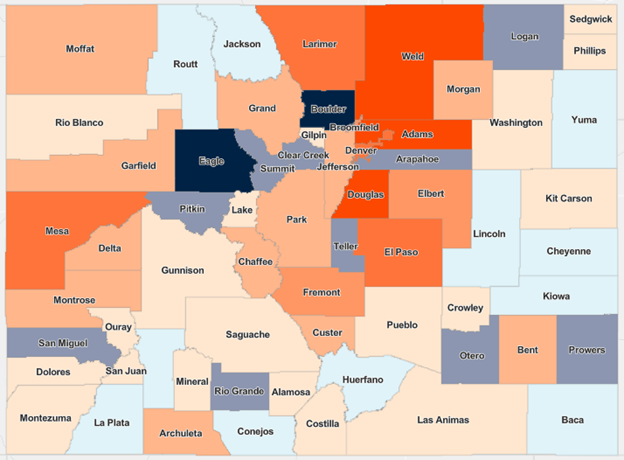

<link rel="stylesheet" href="assets/style.css">

<ul class="nav">
  <li><a href="index.html">Home</a></li>
  <li><a href="introduction.html">Introduction</a></li>
  <li><a href="conclusion.html">Conclusions</a></li>
  <li class="dropdown">
    <a href="dataprep_eda.html" class="dropbtn">Data Preparation and EDA</a>
    

      <a href="clustering.html">Clustering</a>
      <a href="pca.html">PCA</a>
      <a href="naivebayes.html">Naive Bayes</a>
      <a href="dectrees.html">Decision Trees</a>
      <a href="svms.html">SVMs</a>
      <a href="neuralnetworks.html">Neural Networks</a>
    

  </li>
</ul>

# Introduction
# Forecasting Mental Health Service Demand Using Colorado Population Projections

Mental health is a critical public health priority that affects people of all ages, backgrounds, and communities. In Colorado, access to mental health services is especially important as the state continues to experience population growth, demographic shifts, and federal and state budget fluctuations. With new residents arriving every year and existing communities evolving, ensuring that behavioral health services are available, accessible, and affordable becomes an ongoing challenge. This isn’t just about providing support for those currently seeking care, it’s also about planning ahead to meet future needs. Colorado’s policymakers, health systems, and community organizations all face questions about where to place new mental health clinics, how many providers will be needed, and which regions may experience service gaps. Understanding these future needs requires a proactive approach that looks beyond today’s numbers. This project focuses on exploring how Colorado’s projected population growth can be used as a foundation for predicting future mental health service demand across the state. By examining long-term population trends and age breakdowns, we can better anticipate where services will be most needed, helping to guide planning, resource allocation, and policy development.

This project explores how population growth and demographic changes in Colorado over the next 20 to 30 years could shape the future demand for mental health services. It centers on the idea that projected population shifts among high-need age groups can serve as early indicators of where service capacity may fall short. This research aims to bring a proactive lens to an already strained system. It matters because current capacity doesn’t always reflect future need, especially in fast-growing or underserved areas. While several studies and public health strategies have aimed to increase access to care, few have connected those efforts directly to projected population data at the county or regional level. This project offers a framework for using state population projections to anticipate demand and eventually combining those insights with additional datasets to deepen the analysis. Ultimately, this work is about helping local leaders, providers, and policymakers better align services with the communities they serve.

Predictive modeling allows us to simulate different scenarios for mental health demand based on Colorado’s shifting population dynamics. By integrating statistical techniques with geographic and demographic data, areas at highest risk of unmet need can be highlighted. The goal is to inform decision-making around infrastructure investments, workforce development, and policy design, ensuring Colorado is not just reacting to rising demand but planning for it in advance. This project highlights the importance of collaborative planning and data-driven strategies to support equitable access to mental health services for Coloradans.

Colorado’s population trends show both growth and decline across different regions. While counties like El Paso, Adams, and Denver experienced natural increases, many rural and non-metro counties faced population loss due to more deaths than births. In total, 36% of Colorado counties saw overall population decline, driven by net-out migration and natural decrease, especially in places like Arapahoe, Eagle, and Boulder.

This project combines population projection data with predictive analytics techniques such as clustering, principal component analysis (PCA), and supervised learning models like Naive Bayes and decision trees. These methods provide an analysis into hidden patterns in Colorado counties by potential need and emerging trends that may otherwise be obscured in raw data tables. The analytical approach is grounded in Colorado-specific datasets, ensuring regional relevance and practical application for local stakeholders. By translating demographic projections into actionable insights, this research provides a foundation for forward-looking mental health service planning that accounts for both geographic and age-based disparities.

To effectively anticipate future service needs, this project integrates machine learning techniques that go beyond simple trend extrapolation. Predictive modeling using classification algorithms, clustering, and dimensionality reduction provides a more nuanced view of where mental health demand may grow and which populations may be most impacted. By applying tools such as support vector machines (SVMs), decision trees, and principal component analysis (PCA), this analysis identifies patterns across demographic variables and geographic regions that traditional forecasting methods may overlook. These techniques enable us to classify, group, and visualize data in a way that highlights emerging needs.

# Research Questions 
1.	Which Colorado counties are projected to experience the highest population growth between 2025 and 2055?
	Front Range Counties like El Paso, Adams, Weld, Arapahoe, and Douglas. 

2.	How is the age distribution expected to change across Colorado regions over the next 20–30 years?
   Colorado is aging, the share and count of residents age 65+ grow fastest, while working-age growth moderates and varies by region.

3.	What percentage of projected population growth in Colorado is among adults aged 18–64 versus those aged 65 and older?
   Projections show the 65+ population growing roughly by half by 2050, meaning older adults account for a disproportionately large share of net growth.

4.	How might these demographic shifts correlate with future mental health service demand by region?
   Regions with rapid growth in older adults can expect rising need for late-life depression care, dementia-related services, and caregiver supports, while fast-growing younger corridors may see demand for adolescent and young-adult services.

5.	Which Colorado counties currently face mental health provider shortages, and how might that overlap with projected population growth?
   Many rural and frontier counties carry Mental Health Professional Shortage Area designations, and underserved pockets also exist in metro counties.

6.	Are there specific age groups driving the largest increases in projected service demand?
   Yes, older adults (especially 65+ and 75+) are the fastest-growing cohorts, and in some metros, adolescents and young adults also increase with overall growth.

7.	What policies or programs are already in place to address projected mental health service needs across Colorado?
   Colorado’s Behavioral Health Administration (BHA) leads system reforms and workforce efforts, backed by substantial state and federal behavioral-health spending, and statute establishes a statewide workforce-development program.

8.	How do rural and urban counties compare in terms of both projected population growth and existing mental health resources?
   Urban Front Range counties see the largest absolute population gains and more providers overall but still contain underserved areas.

9.	What gaps exist in the current data that make it harder to forecast mental health service demand?
   Key gaps include timely, granular service-utilization data, consistent race/ethnicity and payer detail, provider capacity and wait-time data, and small-area population projections beyond 2050.

10.	How can predictive modeling help mental health organizations and policymakers plan for future needs more effectively?
   Models can combine demographic projections with current utilization to rank regions by future risk.

